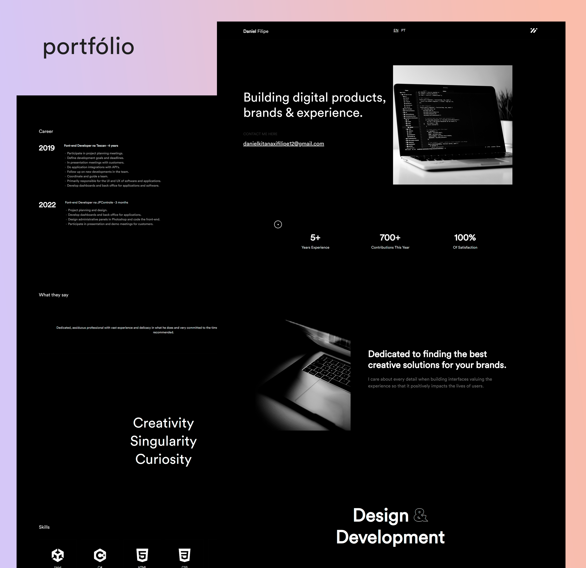

# Meu Portfólio

## Versão: v0.1.0
### Acesse o site em: [danielkitanaxifilipe.github.io](https://danielkitanaxifilipe.github.io/danielfilipe/)

---

## Recursos 📋
- Totalmente responsivo
- HTML5 e CSS3 válidos
- Animação de digitação

---

## Seções 📚
- Início
- Sobre
- Habilidades
- Projetos
- Contate-me
- Rodapé

---

## Sobre Mim 👋
Olá! Eu sou o Daniel Quingongo Kitanaxi Filipe, um desenvolvedor apaixonado por criar produtos úteis e de alta qualidade. Com mais de 6 anos de experiência no mundo do desenvolvimento, estou constantemente em busca do próximo nível e comprometido em aprender novas tecnologias. Sou especializado em Unity e desenvolvimento front-end.

Tenho trabalhado como desenvolvedor front-end na Tescan por 4 anos, onde tive a oportunidade de liderar equipes, participar de reuniões de planejamento de projetos e criar interfaces de usuário e experiências excepcionais.

Além do desenvolvimento, também sou um entusiasta dos jogos e mantenho um perfil no [itch.io](https://daniel-kitanaxi-filipe.itch.io/) onde compartilho meus projetos de jogos.

---

## Ferramentas usadas 🛠️
- [GitHub Pages](https://docs.github.com/en/pages) - Para hospedar o site estático (HTML, CSS, JS)
- [Font Awesome](https://fontawesome.com/) - Toolkit de fontes e ícones baseado em CSS
- [Bootstrap](https://Bootstrap.com) - Conjunto de ícones SVG de alta qualidade prontos para uso

---

## Estrutura do Projeto
O projeto está organizado com os seguintes arquivos e diretórios:

- **index.html**: Página inicial do site
- **assets/**: Diretório contendo imagens e ícones
- **style/**: Diretório com arquivos CSS
- **js/**: Diretório com arquivos JavaScript
- **README.md**: Este arquivo que descreve o projeto

---

## Uso
Para visualizar o site ao vivo, [clique aqui](https://danielkitanaxifilipe.github.io/danielfilipe/)

---

## Contato
- **Email**: [danielkitanaxifilipe12@gmail.com](mailto:danielkitanaxifilipe12@gmail.com)
- **GitHub**: [@DanielKitanaxiFilipe](https://github.com/DanielKitanaxiFilipe)
- **LinkedIn**: [Perfil no LinkedIn](https://www.linkedin.com/in/daniel-filipe-779b9b18b/?locale=en_US)

---

## Licença
Esse projeto é protegido por direitos autorais e todos os direitos estão reservados.
